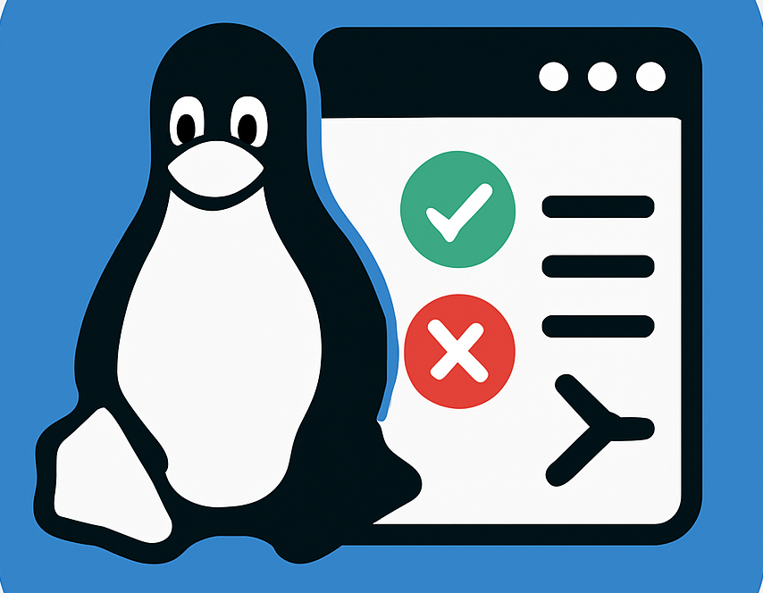
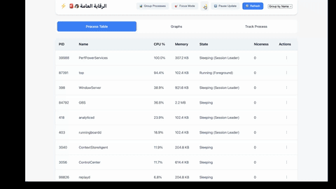

# Elreqaba LPM (Linux Process Monitor) 

A powerful process monitoring tool with three interfaces: Command Line Interface (CLI), Terminal User Interface (TUI), and Electron-based Graphical User Interface (GUI).

## Features

### CLI (Command Line Interface)
The CLI provides a set of commands for process management:

- `get_os`: Display the current operating system
- `ptable [file.csv]`: Display process table (optionally export to CSV)
- `change_nice <pid> <niceness>`: Change process priority
- `kill <pid>`: Terminate a process
- `log <pid>`: Monitor process status changes
- `pause <pid>`: Pause a process
- `resume <pid>`: Resume a paused process
- `track_process <pid> <output.csv> <duration_secs>`: Track process metrics
- `get_process_command <pid>`: Get command details for a process
- `restart_if_failed <pid>`: Monitor and restart a process if it fails
- `tui`: Launch the Terminal User Interface
- `gui`: Launch the Electron-based GUI

### TUI (Terminal User Interface)
A feature-rich terminal interface with the following capabilities:

- Real-time process monitoring
- Sortable columns (PID, PPID, USER, CPU, MEM, PRIORITY, CMD, START, STATUS)
- Process tree view
- Process filtering
- Process actions:
  - Kill processes
  - Pause/Resume processes
  - Change process priority
- System information display
- Process grouping
- Focus mode for high CPU usage processes

[Placeholder for TUI Demo GIF]

### Electron GUI
A modern graphical interface with advanced features:

- Real-time process monitoring with auto-refresh
- Process grouping by name or PPID
- Process tracking with historical data
- Memory and CPU usage graphs
- Process actions:
  - Kill processes
  - Pause/Resume processes
  - Change process priority (nice value)
- Dark/Light theme support
- Process icons for better visual identification
- Intelligent idle process detection
- System process filtering
- Group actions for multiple processes
- Focus mode for high CPU usage processes



## Installation

1. Clone the repository:
```bash
git clone https://github.com/yourusername/Elreqaba-LPM.git
cd Elreqaba-LPM
```

2. Install dependencies:
```bash
# For CLI and TUI
cd src-tauri
cargo build

# For Electron GUI
cd ../electron-gui
npm install
```

## Usage

1. Start the application:
```bash
cd src-tauri
cargo run
```

2. Use the CLI commands or launch the TUI/GUI:
```bash
# For TUI
tui

# For GUI
gui
```

## Development

### Project Structure
```
Elreqaba-LPM/
├── src-tauri/           # CLI and TUI implementation
│   ├── src/
│   │   ├── main.rs     # CLI implementation
│   │   └── TUI.rs      # TUI implementation
│   └── Cargo.toml
└── electron-gui/        # Electron GUI implementation
    ├── index.html
    ├── main.js
    └── package.json
```


